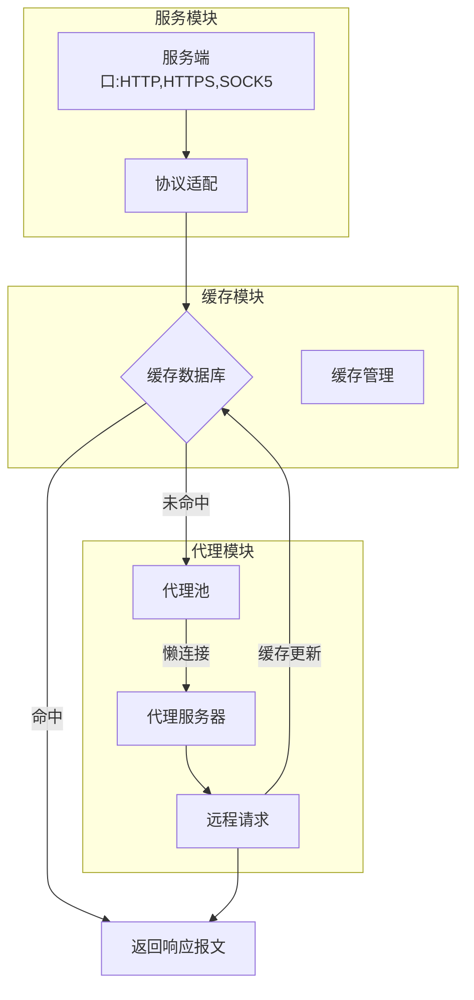

```mermaid
graph TD
  %% 服务模块
  subgraph ENTRY["服务模块"]
    PORT["服务端口:HTTP,HTTPS,SOCK5"]
    PROTOCOL["协议适配"]
  end

  %% 代理模块
  subgraph PROXY["代理模块"]
    POOL["代理池"]
    SERVER["代理服务器"]
    REQ["远程请求"]
    POOL-->|"懒连接"|SERVER
    SERVER-->REQ
  end

  %% 缓存模块
  subgraph CACHE["缓存模块"]
    DB{"缓存数据库"}
    CACHE_MANAGER["缓存管理"]
  end

  %% 数据流
  PORT-->PROTOCOL
  PROTOCOL-->DB
  DB-->|"未命中"|POOL
  DB-->|"命中"|RETURN
  REQ-->|"缓存更新"|DB
  REQ-->RETURN

  %% 返回响应报文
  RETURN["返回响应报文"]

```

